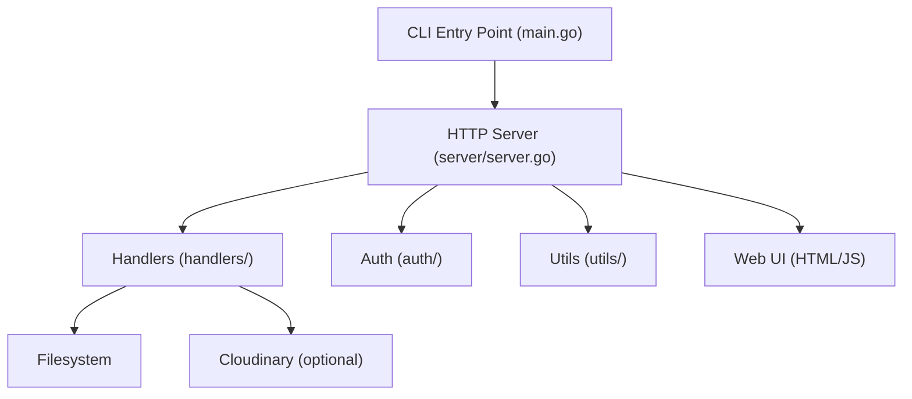

# Architecture & Design

---

## High-Level Flow

1. User runs the CLI to share a file or directory.
2. Server starts, generates a unique access token, and prints a link.
3. User shares the link and token with others.
4. Recipients access the web UI, enter the token, and browse/download files.
5. Session expires after the configured duration.

---

## Component Overview

---

## Main Components

- **CLI (main.go):** Parses flags, loads config, starts the server.
- **Server (server/server.go):** Sets up HTTP routes, middleware, and session logic.
- **Handlers (handlers/):** Serve API endpoints, web pages, and file/directory listings.
- **Auth (auth/):** Token generation, validation, session expiry.
- **Utils (utils/):** File operations, Cloudinary upload, helpers.
- **Web UI:** Minimal HTML/JS for owner and user panels.

---

## Request/Response Lifecycle

1. **Owner starts server:**
   - CLI parses flags, sets up sharing mode (file/dir/cloud).
   - Generates a unique token and session expiry.
2. **User visits link:**
   - Web UI prompts for token.
   - Token is sent with each API request (header or query param).
3. **API endpoints:**
   - `/api/files` — List files/directories (token required)
   - `/api/download/` — Download file (token required)
   - `/` — Owner panel
   - `/token` — User access page
4. **Session expiry:**
   - After duration, all requests are denied.

---

## Security Boundaries
- All file access is restricted to the shared path.
- Symlinks are checked to prevent escape.
- Tokens are required for all sensitive endpoints.
- Rate limiting and brute-force protection are enforced per IP.
- Security headers are set for all responses.

---

## Extensibility
- Handlers and middleware are modular for easy extension.
- Cloud upload is pluggable (currently Cloudinary, can add more).
- Web UI can be replaced or themed as needed.

---

For API details, see [Web UI & API Reference](./api.md). 